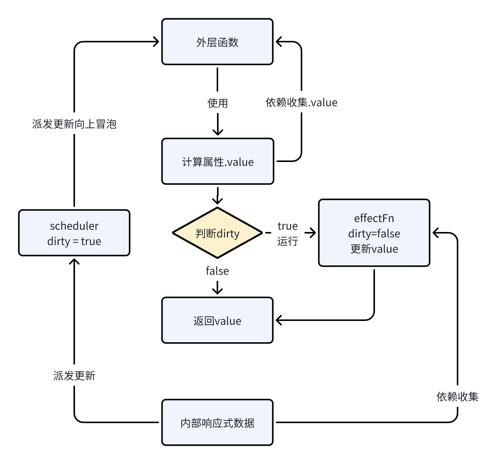

# my-reactivity

## 项目概要

该项目手动实现了 Vue 3 响应式系统的核心功能，包括响应式对象的创建、可变的响应式数据和计算属性。

## 主要功能

1. reactive的实现
2. ref的实现
3. computed的实现


## 原理描述

### 一. reactive（核心） reactive.js
reactive的功能是接受一个对象，返回一个响应式的对象，在响应式对象发生变化时，使用了响应式对象的函数都会重新执行。
要实现这样一个效果，可以问题归纳为两点
1. 监听响应式对象的读写操作
2. 在读时建立对象与函数的对应关系，在写时根据对应关系触发函数重新执行

#### 监听对象的读写操作 handlers.js
1. ##### reactive函数，接受一个普通对象，对其递归的使用proxy进行包装
    - 在get，ownkeys，has时进行依赖收集，触发track函数
    - 在set，deleteProperty时进行派发更新，触发trigger函数
2. #####  对数组有特殊的处理
    - 重写includes，indexOf，lastIndexOf方法，在代理对象中查找一遍找不到再去原始对象查找一遍
    - 重写push，pop，shift，unshift，splice方法，暂停依赖收集，这里和vue3源码中有出入，是在effct函数执行时恢复依赖收集，其余都是暂停态
    - 在set时，发现length发生了变化，如果没有直接设置length，则会手动触发trigger set length，如果直接设置了length，则手动触发trigger delete 下标
#### 关联对象与函数的对应关系 effect.js

维护全局变量activeEffect和effectStack，activeEffect始终指向effectStack的栈顶，activeEffect就是track时收集的依赖函数

1. ##### effect函数
    传入fn，将函数运行的环境和fn一起打包成一个函数effectFn，effectFn执行时，让effectFn入栈，原函数fn执行结束后，effectFn出栈
2. ##### track函数，依赖收集
    收集当前的activeEffect，建立对象与函数的依赖关系，是一个weakMap=>map=>set的结构，对象-属性-函数集合
3. ##### trigger函数，派发更新
    根据track中建立的依赖关系，找到effectFns循环执行

### 二. ref ref.js

接收一个value，返回了一个对象，该对象有一个名为 value 的属性，其中包含了 get 和 set 访问器。
- 当获取 value 时，会调用 track 函数来追踪依赖，并返回当前的值
- 当设置 value 时，会调用 trigger 函数来触发更新，并更新 value 的值为新值


### 三. computed computed.js

1. 内部维护一个value作为返回值，dirty作为value是否需要更新的标记
2. 使用effect函数，传入getter
    - lazy为true，获取到effectFn先不执行
    - 设置scheduler，功能是内部响应式数据派发更新时使dirty为true，且不直接重新运行effectFn，向上派发value值的更新
3. 返回计算属性，有一个value属性，在读取value属性时
    - 根据dirty值判断是否重新运行effectFn来更新value，返回value
    - 对value属性进行依赖收集




## 调试
1. 安装依赖运行项目
```bash
npm install
npm run dev
```
2. 打开浏览器控制台查看输出，调试的代码在index.js中，根据你的需求自行更改